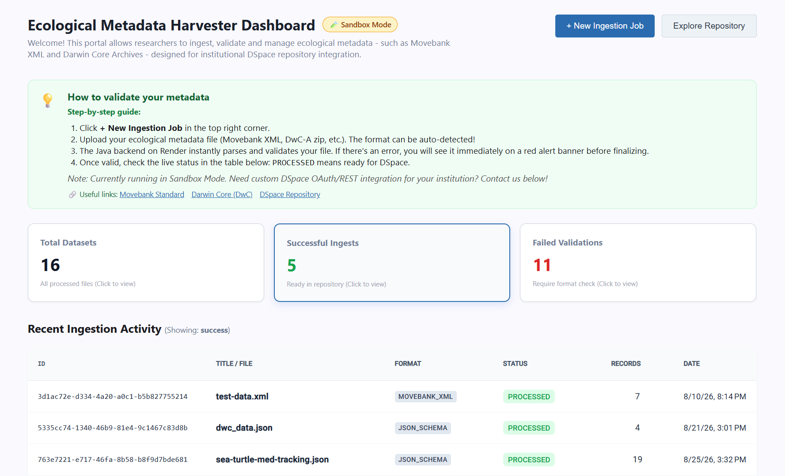
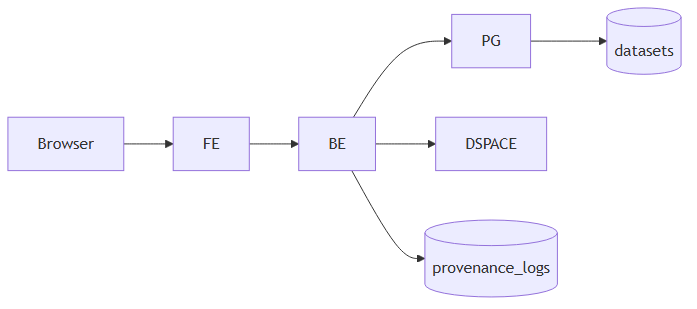

# Ecological Metadata Harvester

An enterprise-grade system designed to ingest, validate and manage ecological metadata such as **Movebank XML** and **Darwin Core Archives** with integration into institutional **DSpace** repositories.

[](https://www.oracle.com/java/)
[](https://spring.io/projects/spring-boot)
[](https://angular.io/)
[](https://www.typescriptlang.org/)
[](https://www.postgresql.org/)
[](https://neon.tech/)

[](https://www.movebank.org/)
[](https://dspace.org/)
[](https://movebank-explorer.pages.dev)

[](https://render.com/)
[](https://pages.cloudflare.com/)
[](https://www.docker.com/)
[](#-current-status-sandbox-mode)

[](https://www.ab.mpg.de/)
[](https://www.uni-konstanz.de/)

## 🧪 Current Status: Sandbox Mode

Currently, the application runs in an isolated sandbox environment. All processed metadata files and validation logs are securely stored locally within a dedicated PostgreSQL database (Neon), without transmitting data to external production repositories.

## 🚀 Live Demo

🔗 **[View Live Application on Cloudflare Pages](https://metadata-harvester.pages.dev)**



## 🏛️ Project Architecture

The high-level system architecture illustrates the data flow from the browser and frontend presentation layer down to the Spring Boot REST backend, asynchronous processing pipelines and persistent storage layers (PostgreSQL, DSpace and local metadata repositories).

The project is split into two independent sub-projects:

- **`backend/`** — Spring Boot REST API responsible for database management (Flyway, JPA), file validation pipelines and data storage.

- **`frontend/`** — Angular 22 Single Page Application providing an administrative dashboard, upload wizards and dataset explorers.

<p align="center">
  
</p>

> _Tip: You can also inspect the raw diagram source code in [ARCHITECTURE.mmd](ARCHITECTURE.mmd)._

---

## 📚 Component-Specific Documentation

For detailed guides on how to build, run and configure each part of the system, please refer to their respective documentation:

- ⚙️ **[Backend README](./backend/README.md)** — Setup guide, environment variables, database configuration and API endpoints.

- 💻 **[Frontend README](./frontend/README.md)** — Angular development server, dependencies, UI components and build instructions.

---

## 🚀 Quick Start (Docker Compose)

You can spin up the entire stack (database and services) using the root configuration:

```bash
docker-compose up --build
```

## 🤝 Contributing

Contributions, issues and feature requests are welcome! Feel free to check the [issues page](https://github.com/wixhub/metadata-harvester/issues).

---

## 📬 Contact & Support

If you have any questions, suggestions or feedback regarding this project, feel free to reach out:

- **Author:** [@wixhub](https://github.com/wixhub)
  - **Telegram:** [@typeweb](https://t.me/typeweb)
- **GitHub Repository:** [moverdm-explorer](https://github.com/wixhub/metadata-harvester)

---

## 📄 License

[](https://opensource.org/licenses/MIT)

This project is open-source and available under the [MIT License](LICENSE).

- **Data Attribution**:
  - Animal tracking data provided by **[Movebank](www.movebank.org)** and individual researchers.
