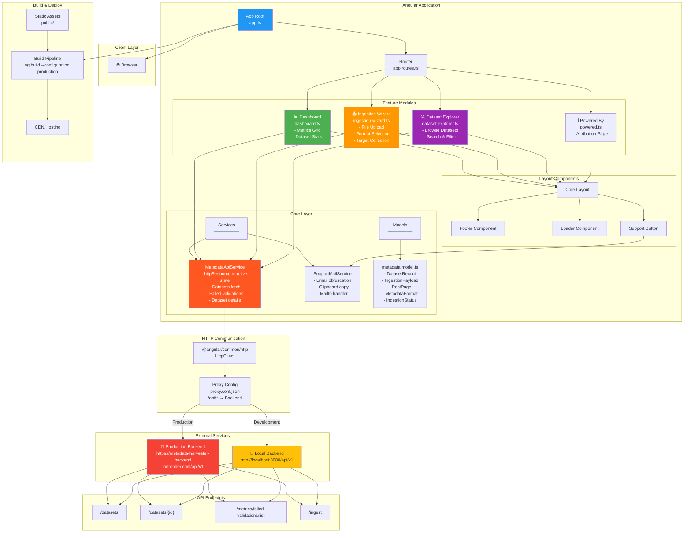

# Ecological Metadata Harvester & Ingestion Gateway (Frontend)

An enterprise-grade Angular administrative dashboard and ingestion wizard. It interfaces directly with the backend ecosystem to manage metadata records, process scientific file uploads and display system telemetry metrics.

---

## 🚀 Live Demo

🔗 **[View Live Application on Cloudflare Pages](https://metadata-harvester.pages.dev)**

---

## 🚀 Tech Stack

- Framework & Core: Angular (Standalone Components, Signals, Reactive Forms, Modern Control Flow) version 22.0.0

- UI Components: Angular Material 22.1.3

- Language: TypeScript 6.0.2

- Styling: Global styles.scss with component-scoped SCSS stylesheets

- State Management & Communication: Angular HttpClient with proxy configuration, reactive signals, and declarative httpResource fetching

- Testing: Vitest 4.0.8

## System Architecture



## 📁 Project Structure

```text
src/
├── app/
│   ├── core/
│   │   ├── models/
│   │   │   └── metadata.model.ts      # TypeScript interfaces & types (DatasetRecord, IngestionPayload, etc.)
│   │   └── services/
│   │       ├── metadata-api.service.ts # REST API gateway integration using httpResource
│   │       └── support-mail.service.ts # Email obfuscation, clipboard copy, and mailto handling
│   ├── features/
│   │   ├── dashboard/                 # System metrics & recent ingestion logs
│   │   ├── ingestion/                 # Multi-format telemetry upload wizard
│   │   ├── explorer/                  # DSpace collection/item repository explorer
│   │   └── powered/                   # Attribution and credits page
│   ├── app.component.ts
│   ├── app.config.ts                  # Global app providers & HttpClient setup
│   └── app.routes.ts                  # Lazy/direct route definitions
├── index.html
└── styles.scss                        # Global root CSS styles & variables
```

## 🌟 Core Features & Routes

- / — Dashboard: Real-time visibility tracking total datasets, successful metadata harvests, and validation error statistics.

- /ingest — Ingestion Wizard: Supports multi-format scientific file uploads including Movebank XML, Darwin Core Archives (DwC-A), and JSON Schemas, mapping them directly to target collections.

- /explorer — Dataset Explorer: Inspect harvested metadata records, view structural status, search, filter, and diagnose error payloads.

- /powered — Powered By: Attribution and technology credits page.

## Data Flow & State Management

The application leverages Angular's modern reactivity primitives:

```Plaintext
User Action → Router → Feature Component → Service → HttpClient → Proxy → Backend API → Response → HttpResource → Signal → Template
```

- Reactive Signals: Built-in signal() handles component-level local state.

- HttpResource: Provides declarative, reactive resource fetching for asynchronous API data integration.

- RxJS: Manages complex asynchronous event streams where applicable.

### 🔗 **API Endpoints**

| Method | Endpoint                                  | Purpose                 |
| ------ | ----------------------------------------- | ----------------------- |
| GET    | `/api/v1/datasets`                        | Fetch all datasets      |
| GET    | `/api/v1/datasets/{id}`                   | Fetch dataset details   |
| GET    | `/api/v1/metrics/failed-validations/list` | Get validation failures |
| POST   | `/api/v1/ingest`                          | Upload new dataset      |

### 🌍 **Environment Configuration**

- **Production**: `https://metadata-harvester-backend.onrender.com/api/v1`
- **Development**: `http://localhost:8080/api/v1`

---

## 🛠️ Local Installation & Setup

### Prerequisites

- Node.js (v18+ recommended)

- Angular CLI (Latest version)

1. Clone & Install Dependencies

```Bash
git clone git@github.com:wixhub/metadata-harvester.git
cd metadata-harvester/frontend
npm install
```

2. Configure API Endpoint

Verify or update the base URL in your service file if your Spring Boot backend runs on a different port or host:

```text
Path: src/app/core/services/metadata-api.service.ts

Default: http://localhost:8080/api/v1/metadata
```

3. Run the Development Server

```Bash
npm start
```

Navigate to http://localhost:4200/ in your browser. The application will automatically reload if you change any of the source files.

## Code scaffolding

Angular CLI includes powerful code scaffolding tools. To generate a new component, run:

```bash
ng generate component component-name
```

For a complete list of available schematics (such as `components`, `directives`, or `pipes`), run:

```bash
ng generate --help
```

## Building

To build the project run:

```bash
ng build
```

This will compile your project and store the build artifacts in the `dist/` directory. By default, the production build optimizes your application for performance and speed.

## Running unit tests

To execute unit tests with the [Vitest](https://vitest.dev/) test runner, use the following command:

```bash
ng test
```

## Running end-to-end tests

For end-to-end (e2e) testing, run:

```bash
ng e2e
```

Angular CLI does not come with an end-to-end testing framework by default. You can choose one that suits your needs.

## Additional Resources

For more information on using the Angular CLI, including detailed command references, visit the [Angular CLI Overview and Command Reference](https://angular.dev/tools/cli) page.
